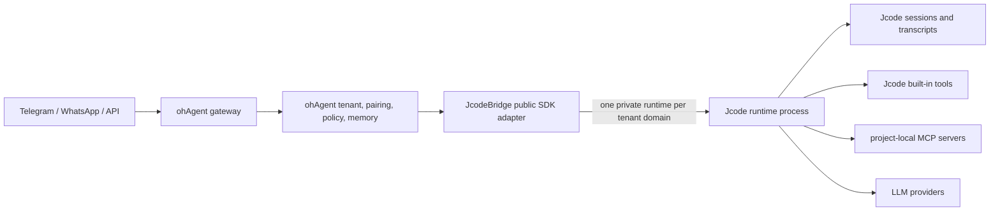

# Jcode SDK Runtime Architecture

## Status

This document defines the target runtime boundary between ohAgent and Jcode. The implementation lives on `feature/jcode-sdk-runtime-boundary` and replaces direct imports from private Jcode application internals with the public `jcode-sdk` client and an external Jcode runtime process.

## Why this boundary exists

ohAgent owns product concerns:

- tenant identity and isolation;
- gateway and API authentication;
- channel routing and localization;
- product memory, scheduling, usage accounting, and policy;
- deployment topology and secret distribution.

Jcode owns agent-engine concerns:

- sessions and transcripts;
- model selection inside a session;
- message and image turns;
- built-in tools and project-local MCP discovery;
- interrupts, cancellation, archive, and retention;
- the stable harness protocol exposed through `jcode-sdk`.

Duplicating Jcode's agent loop or importing private `jcode-app-core` server modules creates version lockstep and caused compile failures whenever private function signatures changed. The SDK process boundary removes that coupling.

## Runtime topology



`JcodeBridge` may retain an in-process provider reference temporarily for existing OpenAI-compatible and WebSocket endpoints, but gateway session execution must use the SDK runtime path. New product paths must not add dependencies on private Jcode server, agent, or lifecycle modules.

## Tenant isolation

Each session operation is scoped by an explicit `tenant_id`.

1. The raw tenant identifier is never used as a filesystem component.
2. ohAgent derives a deterministic 96-bit tenant runtime key from the first 24 hexadecimal characters of SHA-256.
3. Each tenant receives a private persistent `JCODE_HOME` below `OHAGENT_JCODE_RUNTIME_ROOT`.
4. Jcode login files are not inherited by launched private runtimes.
5. Session lookup, archive, detach, cancel, and removal require the owning tenant.
6. Gateway workspace directories use the same opaque tenant key rather than a sanitized raw tenant name.
7. Kubernetes adds the immutable pod UID above the tenant tree so replicas never share runtime sockets or processes.

Expected layout:

```text
/home/jcode/.ohagent/j/<pod-or-compose-domain>/<opaque-tenant-key>/
```

The persistent root may be shared storage, but process sockets and runtime ownership are pod-specific. Tenant-specific provider credentials remain a future provisioning concern. A shared platform provider credential may be inherited from the ohAgent process environment only when that is the intended product policy.

## Lifecycle

1. Gateway authenticates and resolves a tenant.
2. `SessionManager` asks `JcodeBridge` for a tenant-scoped session.
3. The bridge validates tenant and workspace inputs.
4. The bridge lazily launches or reuses the tenant's private Jcode runtime.
5. The SDK creates a session and optionally selects a model.
6. Blocking SDK calls run inside `tokio::task::spawn_blocking`.
7. The SDK returns the completed assistant text to the gateway.
8. The gateway returns that text to the originating channel.
9. Interrupt and cancel requests are forwarded through the SDK.
10. Dropping the bridge/runtime owner shuts down child processes through `LaunchedInstance` ownership.

Runtime state is persistent while the bridge's in-memory session index is not authoritative after a daemon restart. Recovery should discover persisted sessions from the SDK and rebuild product mappings from `SessionStore`. Until that workflow is completed, a restarted daemon may create a new gateway session while the old Jcode transcript remains available for explicit recovery. This limitation is explicit and prevents the current in-memory cache from being mistaken for durable product state.

## Public SDK capabilities used

- launch a private runtime;
- connect and ping;
- create, list, attach, detach, rename, archive, and restore sessions;
- run text and image turns;
- select a model;
- soft interrupt and cancel;
- file status and bounded project access;
- runtime capability discovery.

## Permissions policy

The v0.76.0 harness schema contains permission request and response types, but the bridge does not currently produce permission prompts and does not advertise the `permissions` capability. ohAgent must not pretend the capability exists and must not wait for a prompt that cannot arrive.

Current policy:

- launch with `auto_approve: false`;
- reject unsupported permission responses explicitly;
- fail closed when a requested operation requires an unavailable approval path;
- do not silently enable broad unattended approval.

A future permission integration requires an end-to-end Jcode prompt source, advertised capability, tenant-authenticated response route, expiry, replay protection, audit records, and acceptance tests.

## MCP policy

The SDK does not expose private MCP pool control. Jcode discovers MCP configuration from the tenant workspace using its supported project-local configuration files. This preserves the engine boundary and ensures MCP processes live inside the same tenant runtime domain.

The private fork retains a generic reconnect fix that replaces dead pooled MCP processes instead of returning stale handles. No ohAgent-specific product behavior is added to Jcode.

## Minimal private Jcode fork

The ohAgent-compatible fork is based directly on upstream Jcode v0.76.0 and carries only generic fixes required by the product boundary:

1. reconnect a pooled MCP server after its child process dies;
2. preserve and report the effective working directory on SDK session attach/create;
3. regression tests documenting both behaviors and the unsupported permission response contract;
4. fork-compatible CI that treats `DEPLOY_KEY` as optional when the dependency graph has no SSH-only sources and skips the linked-issue policy only when repository Issues are disabled.

Scheduler, TEAM_MEMORY, ambient-product, and unrelated UI customizations are not required by ohAgent and must not be carried in this minimal branch. The CI compatibility does not skip build, test, formatting, quality, or release jobs.

## Packaging

The ohAgent container builds the daemon and both Jcode runtime executables from pinned source revisions:

- `/usr/local/bin/ohagent-daemon`;
- `/usr/local/bin/jcode`;
- `/usr/local/bin/jcode-harness-api-bridge`.

Required environment:

```text
OHAGENT_JCODE_BINARY=/usr/local/bin/jcode
OHAGENT_JCODE_RUNTIME_ROOT=/home/jcode/.ohagent/j/<runtime-domain>
```

Docker Compose uses a fixed `compose` runtime domain. Kubernetes uses the immutable pod UID. The root remains below the persistent `/home/jcode/.ohagent` volume. Runtime roots and 96-bit tenant keys are intentionally compact because Jcode's Unix domain socket must fit the platform `sun_path` limit. The bridge validates the complete socket path before launching. The Jcode CLI, API bridge, and SDK crate must come from the same submodule revision and the API bridge must be available on `PATH`.

## Failure handling

| Failure | Required behavior |
|---|---|
| Jcode binary missing | Session creation fails with a bounded, sanitized error. |
| Runtime launch fails | No session mapping is inserted. A later request may retry. |
| Duplicate concurrent tenant launch | Only one runtime becomes authoritative; the redundant child is dropped. |
| Cross-tenant session identifier | Lookup fails without revealing whether another tenant owns it. |
| Unsafe workspace path | Reject before launching a runtime. |
| SDK call blocks | Run on the blocking pool, never the async executor. |
| Runtime child exits | The current request fails with a bounded SDK error. A daemon restart relaunches the tenant runtime; automatic in-process health replacement remains future recovery work. |
| MCP child exits | Reconnect through the retained generic pool fix. |
| Permission capability absent | Fail closed and never wait indefinitely. |

## Acceptance requirements

The implementation is complete only when the following are observed:

- private Jcode internals are absent from the gateway session path;
- same-tenant sessions reuse one runtime;
- different tenants receive different opaque runtime homes;
- cross-tenant session access is rejected;
- a real installed/built Jcode runtime completes a text turn through `jcode-sdk`;
- image input reaches the SDK public path;
- gateway returns assistant text instead of discarding it;
- interrupt and cancel use public SDK methods;
- DeepSeek compatible-profile acceptance passes when credentials are available;
- the packaged image contains both binaries and launches the runtime;
- focused and workspace tests, formatting, clippy, build, and final diff checks pass.

The live DeepSeek acceptance is credential-gated and is run explicitly rather than as part of credential-free workspace tests. If credentials or network access are unavailable, the exact external blocker must be recorded instead of substituting a mock for the live check.
