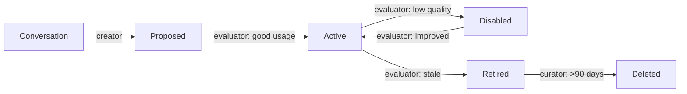

# Phase 4 Completion Report: Self-Learning Skills Engine

**Date:** 2026-07-05
**Project:** ohAgent — 24/7 Personal AI Super-Agent
**Status:** Complete

---

## What Was Built

### 1. Skills Engine (`ohagent-skills` crate)

| Component | File | Purpose |
|-----------|------|---------|
| **Models** | `models.rs` | `Skill`, `SkillUsage`, `SkillStatus`, `SkillOrigin`, `SkillConfig` — core data types with auto-quality computation and retirement logic |
| **Registry** | `registry.rs` | SQLite persistence for skills + usage events, scoped per tenant. 5 tests. |
| **Creator** | `creator.rs` | Analyzes conversation patterns (keyword co-occurrence on 20 task verbs), proposes new skills in `Proposed` status. Includes LLM prompt builder for richer extraction. |
| **Evaluator** | `evaluator.rs` | Records success/failure, recomputes quality scores, promotes `Proposed→Active` after meeting threshold, demotes to `Disabled`, retires stale skills. 2 tests. |
| **Curator** | `curator.rs` | Prunes retired skills >90 days old, merges similar skills (Jaccard overlap on triggers/tags/instructions), enforces per-tenant limit. 3 tests. |

**Skill Lifecycle:**


### 2. Daemon Cron Loop

Added `start_skills_cron()` to the daemon:
- **Every 5 min:** Evaluate all tenant skills (promote, demote, update quality)
- **Every 10 min:** Scan conversations, propose new skills
- **Every 10 min:** Curate (merge similar, prune old retired, enforce limits)
- Graceful shutdown via shared `Notify`

### 3. Telegram Skill Commands

| Command | Description |
|---------|-------------|
| `/skills` | List all learned skills with status and quality |
| `/skill <name>` | Show details (triggers, instructions, usage stats, tags) |
| `/skilluse <name>` | Record a skill usage event (boosts quality) |

All commands support i18n (EN/LV/RU). Wired through `SkillRegistry → TelegramAdapter → Dispatcher`.

### 4. Integration Tests

4 end-to-end tests in `tests/skills_integration.rs`:
- `test_full_skills_lifecycle` — create from memory → evaluate → curate → prune
- `test_no_skills_from_empty_memory` — empty memory = no skills
- `test_evaluation_no_skills` — evaluation on empty = no-op
- `test_curation_no_skills` — curation on empty = no-op

---

## Files Changed

```
crates/ohagent-skills/src/models.rs          — type annotation fix, paren fix
crates/ohagent-skills/src/evaluator.rs       — unused import cleanup
crates/ohagent-skills/src/creator.rs         — unused variable cleanup
crates/ohagent-skills/src/registry.rs        — +all_tenants() method
crates/ohagent-daemon/src/lib.rs            — +start_skills_cron(), skills wiring
crates/ohagent-gateway/Cargo.toml           — +ohagent-skills dep
crates/ohagent-gateway/src/i18n.rs          — +5 skill i18n keys (EN/LV/RU)
crates/ohagent-gateway/src/dispatch.rs      — +skills field, 3 command handlers
crates/ohagent-gateway/src/platforms/telegram.rs — +3 commands, skills wiring
crates/ohagent-daemon/Cargo.toml            — +dev-deps (chrono, uuid)
crates/ohagent-daemon/tests/skills_integration.rs — NEW: 4 integration tests
```

---

## Test Results

```
ohagent-core:    1 passed
ohagent-memory:  6 passed
ohagent-skills: 12 passed
ohagent-daemon:  4 passed (integration)
──────────────────────
Total:          23 passed, 0 failed
```

---

## Next: Phase 5

Candidate directions:
1. **Web Dashboard** — React frontend for skill management, conversation history, agent configuration
2. **WhatsApp/Slack Gateways** — Additional messaging platforms
3. **Agent Autonomy Loop** — Agent self-improvement: analyze its own conversations, propose improvements to its own code
4. **Voice Gateway** — Telegram voice message → STT → LLM → TTS
5. **Multi-Agent Orchestration** — Spawn sub-agents for parallel task execution via Jcode swarm

What would you like to tackle next?
