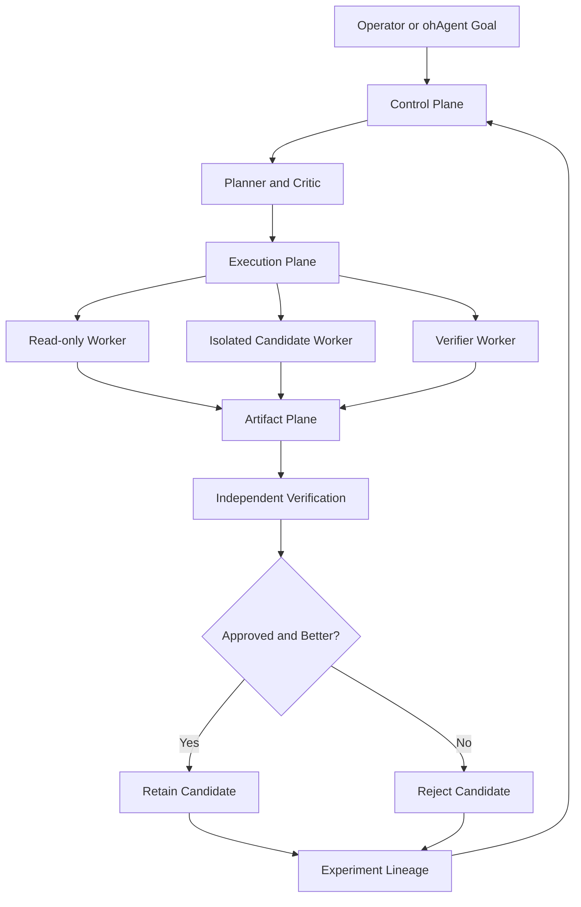

# Rust-Native Graph Engineering Module

## Status

Architecture specification. Not yet implemented.

## Capability

The Rust-native graph-engineering module gives ohAgent a bounded autonomous engineering loop that can plan work, run isolated workers, verify outcomes independently, retain or reject candidates, recover after interruption, and preserve experiment lineage.

The standalone Go [engineering-loop](https://github.com/akvarel/engineering-loop) project is a reference implementation for behavior, safety invariants, and verification discipline. It is not a runtime dependency and will remain an independent open-source project.

See [GRAPH_ENGINEERING_EVALUATION.md](GRAPH_ENGINEERING_EVALUATION.md) for the paper assessment and evidence behind this design.

## Product Boundary

### This Module Owns

- Engineering campaign control in Rust.
- Task contracts and acceptance criteria.
- Task compilation and criticism.
- Worker task-DAG execution.
- Isolated Git workspaces.
- Local command verification.
- Independently routed model verification.
- Artifact persistence.
- Campaign budgets and stopping policy.
- Interruption recovery.
- Experiment lineage and promotion decisions.
- Multi-tenant access control and auditability.

### Existing Components Reused

- Jcode model providers and coding-agent runtime.
- `ohagent-swarm` DAG concepts after hardening.
- ohAgent provider routing and usage accounting.
- HashiCorp Vault integration.
- ohAgent/Jcode tools and sandbox facilities.
- PostgreSQL for durable state.
- Existing semantic memory for conversational recall.

### Explicit Non-Goals

- Embedding Eloop or calling the Go binary.
- Sharing campaign state between Eloop and ohAgent.
- Replacing Jcode's general interactive swarm implementation.
- Building a generic AgentHub clone.
- Migrating every semantic memory into a knowledge graph.
- Production deployment in the first milestone.
- Introducing a specialized graph database in the first version.

## Architectural Invariants

1. Worker output is untrusted input.
2. Worker exit status is operational evidence, not proof of correctness.
3. Task completion requires verifier approval.
4. Repository writes occur only in isolated worktrees or ephemeral checkouts.
5. Verification operates on the exact candidate tree and commit recorded by the attempt.
6. Rejected attempts remain queryable but are never promoted automatically.
7. Task DAG, experiment DAG, and domain knowledge graph remain separate models.
8. Every database query is scoped by `tenant_id`.
9. Secrets are Vault references. Secret values never enter campaign contracts, artifacts, or logs.
10. Effective limits are the most restrictive combination of global, tenant, campaign, and task policy.
11. Unknown schema major versions and unknown enum values are rejected.
12. Resume is idempotent. Terminal attempts never execute twice.
13. Every transition is append-audited before materialized state changes.
14. Partial failure returns completed artifacts, unresolved nodes, and an explicit stop reason.
15. Production access is denied unless a contract explicitly names and permits the production operation.

## Proposed Rust Workspace

```text
crates/
  ohagent-engineering-protocol/   # Versioned request, event, artifact, result types
  ohagent-engineering-control/    # Campaign state machine, policy, budgets, recovery
  ohagent-engineering-executor/   # Worker scheduling and Jcode invocation
  ohagent-engineering-worktree/   # Isolated Git workspaces and patch publication
  ohagent-engineering-verifier/   # Local and model verification
  ohagent-engineering-artifacts/  # Content-addressed immutable artifacts
  ohagent-engineering-lineage/    # Experiment DAG and metric comparison
  ohagent-engineering-cli/        # Non-interactive operator CLI
```

The first implementation may combine small crates, but protocol types must not depend on daemon, gateway, UI, or provider implementation details.

## Planes



### Control Plane

Receives goals, creates validated task contracts, applies policy, allocates budgets, starts workflows, pauses or resumes campaigns, and decides when to stop.

### Execution Plane

Runs Jcode workers, tools, tests, and modifications in isolated environments. It cannot approve completion.

### Artifact Plane

Stores requests, events, prompts, model output, command logs, patches, metrics, verification results, and reports as immutable content-addressed artifacts.

### Lineage Plane

Stores experiment ancestry, attempts, candidate commits, metrics, and promotion decisions.

### Observability Plane

Publishes tenant-scoped structured events, usage, cost, duration, retry, failure-class, and verification metrics.

## Core Protocol

### EngineeringRequest v1

```json
{
  "schema_version": "1.0",
  "request_id": "uuid",
  "tenant_id": "tenant",
  "campaign_id": "campaign",
  "task_id": "task-1",
  "repository": {
    "path": "/repository",
    "base_commit": "sha",
    "git_state_hash": "sha256"
  },
  "contract": {
    "goal": "Add a tested health endpoint",
    "allowed_paths": ["internal/api/**"],
    "excluded_areas": ["deploy/prod/**"],
    "acceptance_criteria": [],
    "verification_commands": [],
    "risk_level": "medium",
    "production_permissions": {},
    "rollback_expectations": "discard candidate worktree"
  },
  "budget": {
    "max_workers": 4,
    "max_concurrency": 2,
    "max_attempts_per_node": 2,
    "max_wall_clock_seconds": 1800,
    "max_worker_seconds": 600,
    "max_model_calls": 10,
    "max_tokens": 250000,
    "max_cost_usd": 10,
    "max_output_bytes": 5000000,
    "max_artifact_bytes": 50000000
  },
  "nodes": []
}
```

### EngineeringNode v1

```json
{
  "id": "stable-node-id",
  "kind": "explore|implement|verify|fix|synthesize",
  "label": "Implement health endpoint",
  "instructions": "...",
  "depends_on": [
    {"node_id": "analysis", "artifact_keys": ["findings.json"]}
  ],
  "input_artifacts": [],
  "output_contract": {
    "required_artifacts": ["result.json"],
    "json_schema": "artifact://schemas/execution-result-v1.json"
  },
  "workspace_mode": "read_only|isolated_worktree",
  "allowed_paths": ["internal/api/**"],
  "model_route": "executor",
  "timeout_seconds": 600,
  "max_attempts": 2
}
```

### EngineeringResult v1

```json
{
  "schema_version": "1.0",
  "request_id": "uuid",
  "status": "completed|partial|failed|cancelled|budget_exhausted",
  "base_commit": "sha",
  "candidate_commit": "sha-or-null",
  "nodes": [],
  "artifacts": [],
  "usage": {
    "model_calls": 0,
    "tokens": 0,
    "estimated_cost_usd": 0,
    "wall_clock_seconds": 0
  },
  "execution_result_artifact": "artifact://.../execution-result.json",
  "unresolved_nodes": [],
  "warnings": []
}
```

## Event Stream

The module emits NDJSON internally and through the CLI. Required events:

- `request_accepted`
- `request_rejected`
- `campaign_started`
- `workspace_created`
- `node_ready`
- `node_started`
- `node_progress`
- `artifact_published`
- `node_completed`
- `node_failed`
- `node_retry_scheduled`
- `node_skipped`
- `verification_started`
- `verification_completed`
- `budget_warning`
- `budget_exhausted`
- `campaign_completed`
- `campaign_cancelled`

Every event includes:

```text
schema_version, event_id, tenant_id, request_id, campaign_id,
task_id, node_id, attempt_id, sequence, timestamp, event_type, payload
```

`sequence` is monotonically increasing within a campaign. The raw event stream is persisted before interpretation.

## State Machines

### Campaign

```text
DRAFT -> READY -> RUNNING -> VERIFYING
VERIFYING -> COMPLETED | DEFERRED | FAILED | BLOCKED | NEEDS_INPUT
RUNNING -> PAUSED | CANCELLED | BUDGET_EXHAUSTED
PAUSED -> RUNNING | CANCELLED
```

### Node

```text
PENDING -> READY -> RUNNING
RUNNING -> COMPLETED | RETRY_WAIT | FAILED | CANCELLED
RETRY_WAIT -> READY
PENDING -> SKIPPED
```

Terminal states are immutable. Recovery reconstructs materialized state from append-only events and immutable artifacts.

## Verification Model

### Local Verification

The verifier:

1. Validates the worker's structured result.
2. Runs explicit local verification commands.
3. Compares changed paths against allowed paths.
4. Verifies the candidate tree hash and commit.
5. Checks claimed evidence against actual logs.
6. Marks missing mandatory criteria unverified.
7. Produces criterion-level evidence and reasons.

### Independent Model Verification

A separately routed verifier receives:

- the original task contract;
- candidate patch and changed-path list;
- complete local command evidence;
- worker result and claims;
- risk and scope information.

It cannot modify the candidate. Failure or invalid output yields `UNVERIFIED`, never approval.

### Promotion Gate

A candidate may be retained only when:

- every mandatory acceptance criterion passes;
- required commands pass;
- no scope or policy violation exists;
- verification is not degraded;
- the candidate tree matches the recorded commit;
- optimization campaigns also satisfy primary metric and non-regression constraints.

## Repository Isolation

Recommended default:

- parallelize read-only exploration freely;
- use one isolated candidate worktree with serialized writers for a coherent candidate;
- use separate worktrees for competing hypotheses;
- run verification from a read-only view of the candidate;
- preserve patches and artifacts before cleanup;
- never mutate, reset, or clean the operator's source checkout.

## Artifact Model

Each artifact has:

```text
id
 tenant_id
 campaign_id
 task_id
 node_id
 attempt_id
 content_hash
 media_type
 byte_size
 storage_location
 created_at
 producer
 schema_version
```

Local content-addressed storage is sufficient for the first version. The interface must allow later S3-compatible object storage. Production secrets remain in Vault and are never artifact content.

## Experiment Lineage

PostgreSQL is the initial store.

### `engineering_experiments`

```text
id uuid primary key
tenant_id text not null
campaign_id text not null
task_id text not null
parent_experiment_id uuid null
hypothesis text not null
base_commit text not null
candidate_commit text null
environment_fingerprint text not null
status proposed|running|evaluated|promoted|rejected|aborted
created_at timestamptz not null
finished_at timestamptz null
```

### `engineering_attempts`

```text
id uuid primary key
tenant_id text not null
experiment_id uuid not null
node_id text not null
worker_id text not null
attempt_number int not null
request_artifact_id text not null
result_artifact_id text null
exit_code int null
failure_class text null
started_at timestamptz not null
finished_at timestamptz null
unique(tenant_id, experiment_id, node_id, attempt_number)
```

### `engineering_metrics`

```text
tenant_id text not null
experiment_id uuid not null
name text not null
value double precision not null
unit text not null
direction minimize|maximize|constraint
source_artifact_id text not null
is_baseline boolean not null
primary key(tenant_id, experiment_id, name, is_baseline)
```

### `engineering_decisions`

```text
id uuid primary key
tenant_id text not null
experiment_id uuid not null
decision promote|reject|revise
reason text not null
verification_artifact_id text not null
decided_by text not null
created_at timestamptz not null
```

Required queries:

- children of an experiment;
- lineage to root;
- active leaves;
- comparison of candidates;
- best verified metric under constraints;
- rejected attempts related to a hypothesis.

## Knowledge Graph Boundary

The experiment DAG records work lineage. Existing semantic memory records conversational knowledge. A domain knowledge graph is a separate future capability.

Add it only when a concrete use case requires connected entity queries, source provenance, contradictions, temporal facts, or shared world state. It must not reuse experiment edges or identifiers as domain relations.

## Delivery Plan

### Phase 0: Reproducible Baseline

1. Regenerate and review `Cargo.lock` intentionally.
2. Require `cargo test --locked` in CI.
3. Add fake-worker coordinator integration tests.
4. Fix dependency artifact propagation.
5. Reject malformed plans atomically.
6. Reject unknown task kinds.
7. Enforce configured depth or remove it from the public contract.

Exit criteria:

- Locked focused and workspace tests pass.
- Invalid graph input cannot be silently accepted.

### Phase 1: Protocol and Artifact Foundation

1. Implement versioned Rust protocol types.
2. Implement strict DAG validation, including cycles and missing dependencies.
3. Add content-addressed artifacts.
4. Add full NDJSON events.
5. Add stable worker and attempt identities.

Exit criteria:

- Golden request, event, and result fixtures pass.
- Full results are available without preview truncation.

### Phase 2: Isolated Execution

1. Add read-only and isolated-worktree modes.
2. Enforce allowed paths.
3. Terminate full process trees on timeout or cancellation.
4. Add worker, concurrency, output, model-call, token, cost, and wall-clock budgets.
5. Persist partial results before cleanup.

Exit criteria:

- Parallel writers never share a checkout.
- Cancellation leaves the operator checkout unchanged.

### Phase 3: Rust Control and Verification Plane

1. Add task contracts and policy hashing.
2. Add planner and independent critic roles.
3. Add local verifier and criterion evidence.
4. Add separately routed model verifier.
5. Add append-only campaign state and idempotent recovery.
6. Add reporting and operator commands.

Exit criteria:

- No worker can complete a task without verifier approval.
- Interrupted campaigns resume without duplicate attempts.

### Phase 4: Experiment Lineage

1. Add PostgreSQL lineage tables.
2. Link campaign, task, node attempt, candidate commit, metrics, and verification.
3. Add lineage queries and CLI commands.
4. Preserve rejected experiment evidence.

Exit criteria:

- Every candidate decision is reconstructable from immutable evidence.

### Phase 5: Metric Ratchet

1. Add baseline and candidate metric commands.
2. Add direction and tolerance.
3. Add correctness and non-regression constraints.
4. Add retain, reject, and revise decisions.
5. Preserve alternative branches.

Exit criteria:

- A disposable benchmark repository demonstrates automatic retain/reject behavior without mutating its source checkout.

## Required Test Matrix

### Protocol

- Unknown major version rejected.
- Unknown enum rejected.
- Duplicate node rejected.
- Missing dependency rejected.
- Cycle rejected before execution.
- Missing required artifact blocks the child.

### Execution

- Effective concurrency is never exceeded.
- Timeout terminates the full process tree.
- Retry produces a new attempt identity.
- Cancellation emits a terminal event.
- Budget exhaustion returns partial completed work.
- Oversized output cannot exhaust memory.
- Dependency artifacts reach the dependent node.

### Repository Safety

- The source checkout remains unchanged.
- Disallowed paths fail publication.
- A stale base commit rejects execution.
- Concurrent external mutation forces replanning.
- Cleanup cannot delete unpersisted evidence.

### Verification

- Exit code zero plus failed criteria cannot complete.
- Unsupported evidence claims are rejected.
- Verifier failure becomes `UNVERIFIED`.
- Candidate commit and verified tree hash must match.
- A worker cannot write during verification.

### Multi-Tenant and Secrets

- Every lookup is tenant-scoped.
- Cross-tenant artifact references are rejected.
- Vault references never resolve into logs or artifacts.
- Production permissions default to false.

## Operator Surface

Initial CLI:

```text
ohagent engineering plan <goal>
ohagent engineering run <goal>
ohagent engineering status <campaign-id>
ohagent engineering continue <campaign-id>
ohagent engineering stop <campaign-id>
ohagent engineering report <campaign-id>
ohagent engineering experiment lineage <experiment-id>
ohagent engineering experiment children <experiment-id>
ohagent engineering experiment leaves <campaign-id>
ohagent engineering experiment compare <a> <b>
```

Operator-visible strings must use i18n keys with EN, LV, and RU catalogs.

## First Implementation Slice

The first code change should not implement the full campaign engine. It should establish a trustworthy execution foundation:

1. Fix locked dependency reproducibility.
2. Add strict swarm plan validation.
3. Add dependency artifact propagation.
4. Add stable attempt records and full result artifacts.
5. Add fake-worker integration tests for success, failure, retry, and timeout.
6. Add isolated-worktree execution behind an internal API.

Only after this slice passes should the Rust control and verification plane be built.
